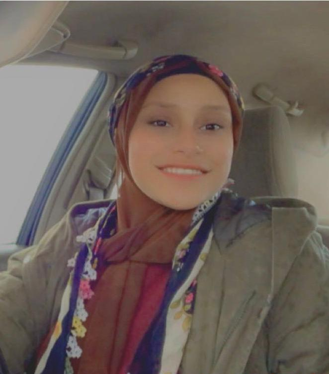

<span style="font-weight: bold;text-align: center; display: inline">
  <br/> 
</span>
 


# Sarah Awik
`Programmer, TOT`
<div>
<a href="awiksarah@gmail.com">awiksarah@gmail.com</a>
| <a href="https://github.com/AWIKSARAH">My GITHUB page</a> | +961-81457099
</div>

## Currently

Prepare to be a Full Stack Developer

</br>

## <ins> Skills </ins>


</br>

` Professional Skill`:
- Creativity
- Problem Solving
- Public Speaking
- Teamwork Skills
  
` Technical Skill`:

- HTML5
- CSS
- PHP
- JAVASCRIPT

 
## <ins> Experience </ins>

`2020-2021` &nbsp;
__Trainer__ 
```
A certified trainer from the CO-DE project and ANERA in several areas:
Training of trainers (TOT) on the SCRATCH program
life skills, body language.
```
`2018 - 2021` &nbsp;
__FreeLancer__
```
Writing codes by receiving software projects for graduate students.
Remove backgrounds, write Word Excel PowerPoint files
Posters, Logo Design
```

`2018 - 2020`&nbsp;
__Data Entry__
```
Data entry into the Lebanese Ministry of Health system
```
</br>

## <ins> Education </ins>

`2018-2019`
__Official Orthodox Higher
Institut, Technical License
in Programming.__

`2017 - 2018`
__Official Orthodox Higher
Institut, Technical Excellence
Certificate in
Management Informatics__


`2014 - 2015`
__Meshah Public High School
2014-2015, Official high school
diploma of Life Sciences__


